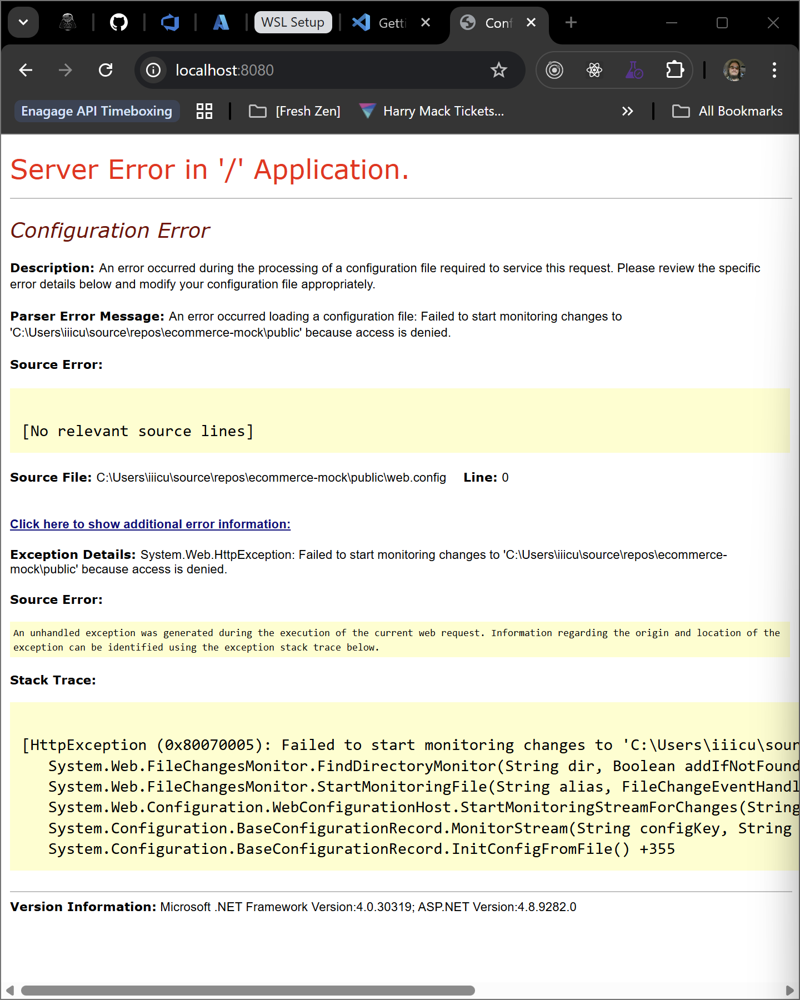
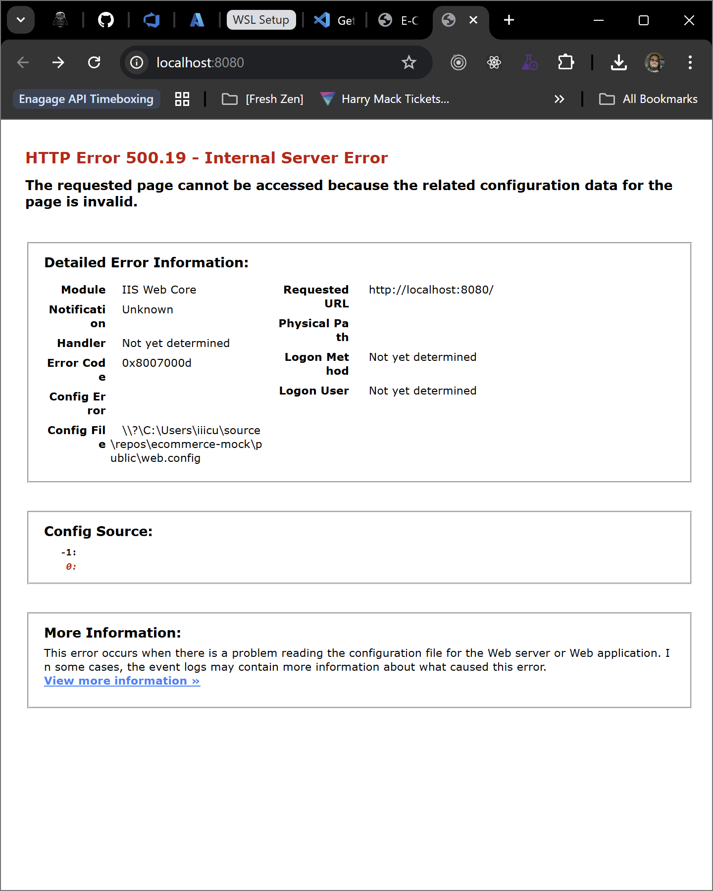
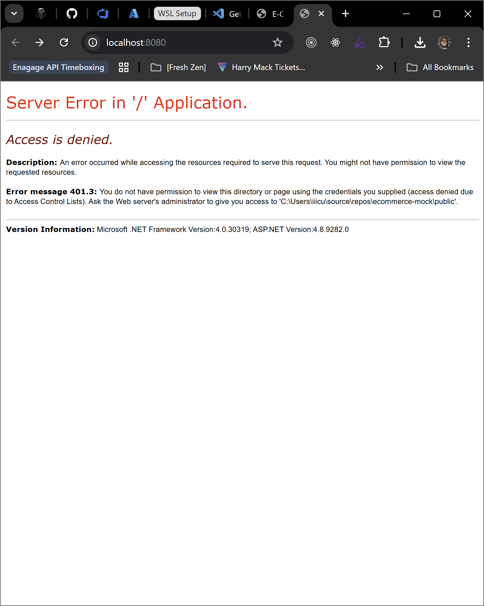
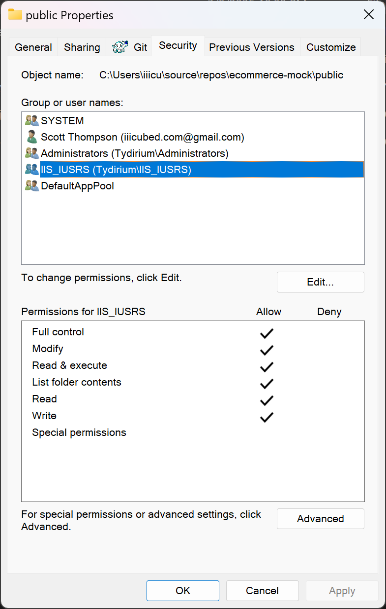
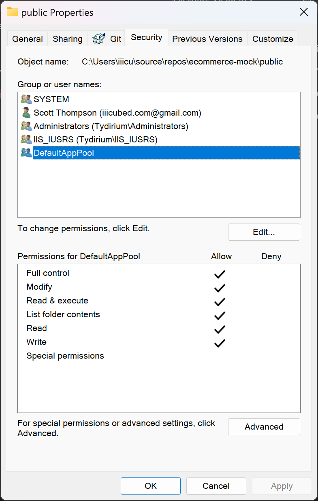
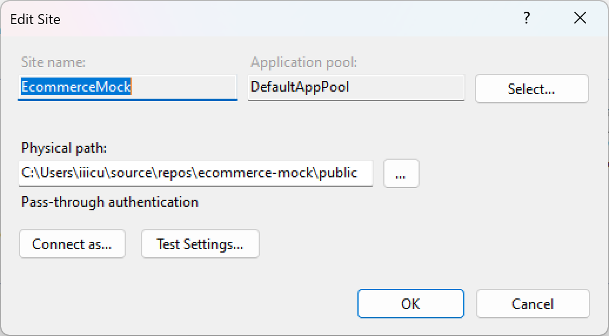
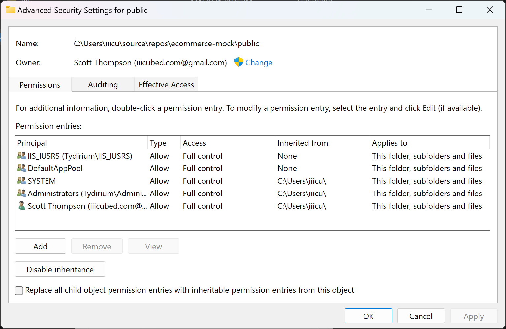
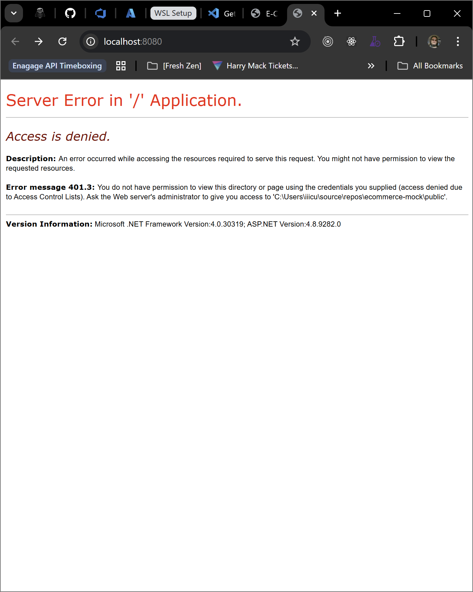
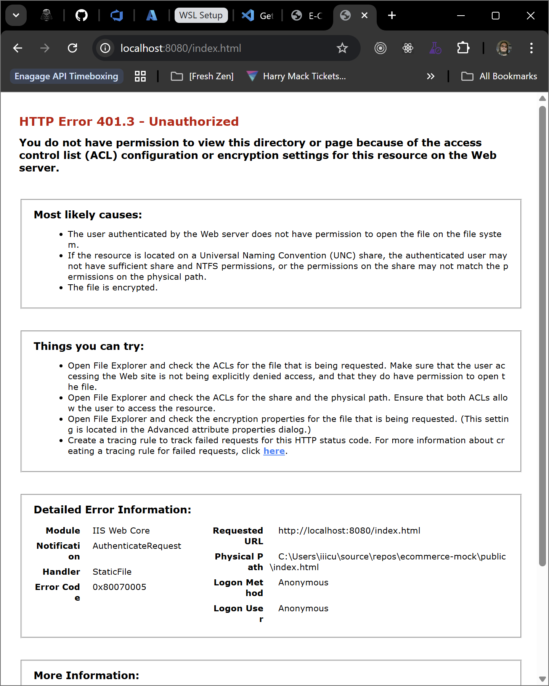
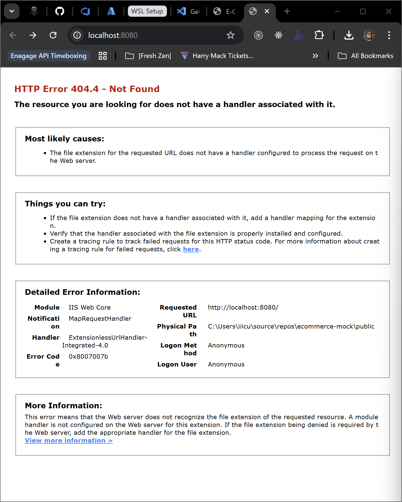

# Questions

## First Question

bookmark my progress at step 2 above so we can come back to it; the screenshot attached is the error message i am getting running the iis site at localhost:8080 per your instructions; help me get that fixed


## First Response

Thanks for sharing the screenshot and your progress update! I’ve bookmarked your spot at **Step 2: Set Up Selenium Tests** in the "Automated E-Commerce Testing Suite" project. We’ll circle back to that once we resolve the IIS hosting issue you’re encountering at `localhost:8080`. The error message indicates a **Configuration Error** with the specific issue being an "access is denied" error when IIS tried to monitor changes to the `web.config` file in `C:\Users\iliuc\source\repos\ecommerce-mock\public`. Let’s troubleshoot and fix this step-by-step.

---

### Diagnosing the Issue

The error suggests IIS cannot access or monitor the `web.config` file in your project’s `public` directory, likely due to:

- **Permissions**: The IIS application pool user (typically `IIS_IUSRS` or the application pool identity) lacks read/execute permissions on the folder.
- **Missing `web.config`**: IIS might expect a `web.config` file, but none exists yet (our Node.js app doesn’t inherently need one unless configured for ASP.NET compatibility).
- **File System Lock**: Another process (e.g., your `node app.js` command) might be locking the directory.

Since your app is a Node.js Express app hosted via IIS (not a .NET app), the `web.config` issue might stem from IIS treating it as an ASP.NET application by default. Let’s fix this.

---

### Step-by-Step Fix

#### 1. Check for an Existing `web.config`

- Navigate to `C:\Users\iliuc\source\repos\ecommerce-mock\public` in File Explorer.
- Look for a `web.config` file. If it exists, open it and check for errors. If it doesn’t (likely the case here), IIS might be auto-generating one or misinterpreting the setup.

#### 2. Grant Permissions to IIS_IUSRS

- **Right-click** the `ecommerce-mock\public` folder, select **Properties** > **Security** tab.
- Click **Edit** to change permissions.
- Ensure the **IIS_IUSRS** group (and your user account) has **Read & Execute**, **List folder contents**, and **Read** permissions.
  - If missing, click **Add**, type `IIS_IUSRS`, click **Check Names**, then **OK**. Apply the permissions.
- Click **Advanced**, ensure the application pool identity (e.g., `IIS AppPool\DefaultAppPool`) has similar rights, and check **Replace all child object permissions**.

#### 3. Create a Basic `web.config` for Node.js Reverse Proxy

Since you’re hosting a Node.js app, IIS needs a `web.config` to proxy requests to your Node.js server (running on port 3000). Create a `web.config` file in the `public` directory:

- Open Notepad or Visual Studio Code.
- Paste this configuration:

  ```xml
  <?xml version="1.0" encoding="UTF-8"?>
  <configuration>
    <system.webServer>
      <handlers>
        <add name="iisnode" path="app.js" verb="*" modules="iisnode" />
      </handlers>
      <rewrite>
        <rules>
          <rule name="Node.js Rule" stopProcessing="true">
            <match url="/*" />
            <action type="Rewrite" url="app.js" />
          </rule>
        </rules>
      </rewrite>
    </system.webServer>
  </configuration>
  ```

- Save it as `web.config` in `C:\Users\iliuc\source\repos\ecommerce-mock\public`.

- **Note**: This assumes `iisnode` (an IIS module for Node.js) is installed. If not, install it:
  1. Download and install `iisnode` from [GitHub](https://github.com/tjanczuk/iisnode/releases) (e.g., `iisnode-full-v0.2.21-x64.msi`).
  2. Restart IIS: Open Command Prompt as Admin and run `iisreset`.

#### 4. Adjust IIS Site Configuration

- Open **IIS Manager**.
- Select your `EcommerceMock` site (port 8080).
- In the right pane, click **Browse *:8080 (http)** to confirm the error persists.
- If using the reverse proxy approach, ensure the physical path points to `ecommerce-mock` (not just `public`), and the `app.js` file is accessible.

#### 5. Run Node.js Separately

Since IIS might conflict with your manual `node app.js` on port 3000, let’s decouple them:

- Stop the Node.js server if running (`Ctrl+C` in the terminal).
- Update `app.js` to listen on a different port (e.g., 8081) to avoid clashes:

  ```javascript
  const port = 8081; // Changed from 3000
  app.listen(port, () => console.log(`Running on http://localhost:${port}`));
  ```

- Run it again: `node app.js`.
- Test `http://localhost:8081`—it should work.

- Update the `web.config` `rewrite` rule to match:

  ```xml
  <action type="Rewrite" url="http://localhost:8081/{R:1}" />
  ```

  (This proxies IIS requests to your Node.js server.)

#### 6. Test the IIS Site

- Restart IIS: `iisreset` in Command Prompt (Admin).
- Browse to `http://localhost:8080`.
- If it loads, great! If not, check the Event Viewer (Windows Logs > Application) for more clues.

#### 7. Fallback: Use IIS as a Static File Server

If the reverse proxy fails, simplify:

- Move `index.html` to the root `ecommerce-mock` folder.
- Update IIS to serve static files:
  - In IIS Manager, right-click `EcommerceMock` > **Add Virtual Directory**.
  - Alias: `public`, Physical Path: `C:\Users\iliuc\source\repos\ecommerce-mock\public`.
  - Ensure the site points to `ecommerce-mock` as the root.
- Test again at `http://localhost:8080`.

---

### Troubleshooting Tips

- **Still Denied?**: Ensure no antivirus or Windows Defender is blocking IIS access. Add an exception for the folder.
- **Port Conflict?**: Use `netstat -a -n | find "8080"` in Command Prompt to check if port 8080 is in use. Change the IIS site to 8081 if needed.
- **Logs**: Check `C:\Windows\System32\LogFiles\HTTPERR` for IIS-specific errors.

---

### Next Steps

Try these fixes and let me know the result—does `http://localhost:8080` load now? If it works, we’ll refine the setup (e.g., automate Node.js with IIS). If not, share any new error messages, and I’ll dig deeper. Once resolved, we’ll resume **Step 2: Set Up Selenium Tests** and proceed to the blog post for Phase 1. You’ve got this—let’s get that site running!

## Second Question

the screenshot is showing the latest error BEFORE i reconfigure iis to serve static files; what advice can you give me about this error?


## Second Response

The screenshot shows an **HTTP Error 500.19 - Internal Server Error** when accessing `localhost:8080`, indicating that IIS cannot process the request due to invalid configuration data in the `web.config` file located at `\\?\C:\Users\iliuc\source\repos\ecommerce-mock\public\web.config`. This error occurred *before* you reconfigured IIS to serve static files, so let’s analyze the issue and provide advice to resolve it. Since you’re hosting a Node.js Express app via IIS, this error likely stems from a mismatch between IIS’s expectations and the setup for a Node.js application.

---

### Diagnosing the Error

The error message provides key details:

- **Module**: IIS Web Core
- **Error Code**: 0x8007000d (indicating a malformed configuration file)
- **Config File**: `C:\Users\iliuc\source\repos\ecommerce-mock\public\web.config`
- **Config Source**: The problematic section starts at line 0, but no specific line is highlighted, suggesting the entire `web.config` file is invalid or unreadable.

#### Likely Causes

1. **Invalid `web.config` Syntax**: The `web.config` file you added (to proxy requests to your Node.js server) might have incorrect syntax or unsupported directives.
2. **Missing `iisnode` Module**: Since you’re proxying a Node.js app, IIS expects the `iisnode` module to handle Node.js execution. If `iisnode` isn’t installed or configured, IIS will fail to parse the `web.config`.
3. **Permissions Issue**: Although we addressed permissions in the previous step, there might still be an access issue preventing IIS from reading the `web.config`.
4. **IIS Misconfiguration**: IIS might be treating the app as an ASP.NET application (which it isn’t), leading to a configuration mismatch.

---

### Advice to Resolve the Error

#### 1. Verify `web.config` Syntax

The `web.config` you added in the previous step is meant to proxy requests to your Node.js server. Let’s double-check it for correctness:

```xml
<?xml version="1.0" encoding="UTF-8"?>
<configuration>
  <system.webServer>
    <handlers>
      <add name="iisnode" path="app.js" verb="*" modules="iisnode" />
    </handlers>
    <rewrite>
      <rules>
        <rule name="Node.js Rule" stopProcessing="true">
          <match url="/*" />
          <action type="Rewrite" url="app.js" />
        </rule>
      </rules>
    </rewrite>
  </system.webServer>
</configuration>
```

- **Issue Check**: The error code `0x8007000d` often means the XML is malformed. Ensure there are no typos, missing tags, or incorrect attributes. The above snippet looks correct, but confirm it matches exactly.
- **Fix**: If there’s a syntax error (e.g., missing closing tag), fix it in Visual Studio Code. Save and retry `http://localhost:8080`.

#### 2. Confirm `iisnode` Installation

The `web.config` references the `iisnode` module (`modules="iisnode"`), which IIS uses to run Node.js apps. If `iisnode` isn’t installed, IIS will throw a 500.19 error because it can’t resolve the module.

- **Check Installation**:
  1. Open **IIS Manager**.
  2. At the server level (top node), double-click **Modules**.
  3. Look for `iisnode` in the list. If it’s missing, you need to install it.
- **Install `iisnode`**:
  1. Download the latest `iisnode` installer from [GitHub](https://github.com/tjanczuk/iisnode/releases) (e.g., `iisnode-full-v0.2.21-x64.msi`).
  2. Run the installer (requires admin rights).
  3. Restart IIS: Open Command Prompt as Admin and run `iisreset`.
- **Retry**: Browse to `http://localhost:8080`. If `iisnode` was the issue, it should now work.

#### 3. Adjust `web.config` for Proxying

The current `web.config` tries to execute `app.js` directly via `iisnode`. Since you’re running `node app.js` separately on port 8081 (as per the previous step), let’s modify `web.config` to proxy requests to that port instead:

- Open `C:\Users\iliuc\source\repos\ecommerce-mock\public\web.config`.
- Replace the content with:

  ```xml
  <?xml version="1.0" encoding="UTF-8"?>
  <configuration>
    <system.webServer>
      <rewrite>
        <rules>
          <rule name="Proxy to Node.js" stopProcessing="true">
            <match url="^(.*)$" />
            <action type="Rewrite" url="http://localhost:8081/{R:1}" />
          </rule>
        </rules>
      </rewrite>
    </system.webServer>
  </configuration>
  ```

- **Explanation**: This removes the `iisnode` dependency and instead proxies all requests from `localhost:8080` (IIS) to `localhost:8081` (your running Node.js server).
- Ensure your Node.js server is running: `node app.js` (listening on 8081).
- Restart IIS: `iisreset`.
- Test: Browse to `http://localhost:8080`.

#### 4. Reconfirm Permissions

Although we addressed this earlier, let’s double-check:

- Right-click `C:\Users\iliuc\source\repos\ecommerce-mock\public`, go to **Properties** > **Security**.
- Ensure `IIS_IUSRS` and the application pool identity (e.g., `IIS AppPool\DefaultAppPool`) have **Read & Execute** permissions.
- If changes are made, restart IIS (`iisreset`) and retry.

#### 5. Check IIS Site Configuration

- Open **IIS Manager**.
- Select the `EcommerceMock` site.
- Confirm the **Physical Path** points to `C:\Users\iliuc\source\repos\ecommerce-mock\public`.
- In the right pane, under **Manage Website**, click **Restart**.
- Test again: `http://localhost:8080`.

#### 6. Alternative: Remove `web.config` Temporarily

If the above steps don’t work, let’s rule out `web.config` as the culprit:

- Move `web.config` out of the `public` folder (e.g., to your desktop).
- Restart IIS: `iisreset`.
- Test: `http://localhost:8080`.
- If it loads (or gives a different error), the issue is indeed the `web.config`. If not, the problem might be deeper (e.g., IIS setup or Node.js integration).

#### 7. Check Event Viewer for More Details

- Open **Event Viewer** (Windows key, type `Event Viewer`).
- Navigate to **Windows Logs** > **Application**.
- Look for errors related to IIS or `EcommerceMock` around the time you accessed `localhost:8080`.
- Note any additional details (e.g., specific permissions errors) and share them if the issue persists.

---

### Additional Advice

- **Node.js Port**: Ensure `node app.js` is running on port 8081 without conflicts. Use `netstat -a -n | find "8081"` to confirm.
- **IIS Features**: Ensure the URL Rewrite module is installed in IIS (required for proxying). In **Programs and Features**, select **Turn Windows features on or off**, expand **Internet Information Services** > **World Wide Web Services** > **Application Development Features**, and check **URL Rewrite**.
- **Fallback**: If proxying fails, consider hosting the Node.js app directly on port 8080 (without IIS) for now, just to proceed with testing. You can revisit IIS later.

---

### Second Next Steps

Try these steps and let me know the outcome—does `http://localhost:8080` load now? If it works, we’ll confirm the setup is stable and proceed to **Step 2: Set Up Selenium Tests**. If not, share any new errors or Event Viewer logs, and I’ll help refine the fix. Once this is resolved, we’ll draft the **Phase 1 blog post** to announce your project. You’re close—let’s get this site up and running!

## Third Question

i moved the web.config and now i am getting the error in the attached screenshot


## Third Response

Thanks for the update and the new screenshot! The error you’re now encountering is an **HTTP Error 401.3 - Access is denied**, which indicates that IIS is unable to serve the requested resources at `http://localhost:8080` because the application pool identity or the user account lacks the necessary permissions to access the directory `C:\Users\iliuc\source\repos\ecommerce-mock\public`. This error occurred after you moved the `web.config` file, which suggests that IIS is now defaulting to its built-in behavior (likely trying to serve static files or interpret the directory without the previous configuration), but it’s hitting a permissions wall. Let’s resolve this step-by-step.

---

### Third Diagnosing the Issue

- **Error Code 401.3**: This is an authorization error, meaning the IIS application pool identity (e.g., `IIS_IUSRS` or the specific app pool user like `DefaultAppPool`) doesn’t have sufficient rights to read the `public` folder or its contents.
- **Context**: Since you moved the `web.config`, IIS is no longer using the proxy configuration to route to your Node.js server. Instead, it’s attempting to serve the `public` directory directly as a static file host, but access is blocked.
- **Root Cause**: Likely a permissions mismatch or oversight after the folder structure was set up.

---

### Third Step-by-Step Fix

#### 1. Grant Full Permissions to IIS_IUSRS and Application Pool Identity

- **Navigate** to `C:\Users\iliuc\source\repos\ecommerce-mock\public` in File Explorer.
- **Right-click** the `public` folder, select **Properties** > **Security** tab.
- **Check Current Permissions**:
  - Ensure **IIS_IUSRS** is listed. If not, click **Edit** > **Add**, type `IIS_IUSRS`, click **Check Names**, then **OK**.
  - Select **IIS_IUSRS** and check **Full Control** (or at least **Read & Execute**, **List folder contents**, **Read**).
- **Application Pool Identity**:
  - If using the default app pool (`DefaultAppPool`), add `IIS AppPool\DefaultAppPool` (replace `DefaultAppPool` with your site’s app pool name if different).
  - Grant it **Full Control** as well.
- **Apply Changes**:
  - Click **Apply**, then **OK**.
  - Check **Replace all child object permissions** to propagate to subfolders/files.
- **Restart IIS**: Open Command Prompt as Admin and run `iisreset`.

#### 2. Verify IIS Site Configuration

- Open **IIS Manager**.
- Select the `EcommerceMock` site (port 8080).
- Confirm the **Physical Path** is set to `C:\Users\iliuc\source\repos\ecommerce-mock\public`.
- In the right pane, click **Edit Permissions** and ensure the Security settings match what you set above (IIS_IUSRS and app pool identity have access).
- Restart the site: Right-click `EcommerceMock` > **Restart**.

#### 3. Test Static File Serving

Since the `web.config` is moved, IIS will attempt to serve `index.html` as a static file from the `public` directory.

- Ensure `index.html` is present in `C:\Users\iliuc\source\repos\ecommerce-mock\public`.
- Browse to `http://localhost:8080`. If permissions are fixed, you should see the product list page.
- If it still fails, check for other files (e.g., ensure no hidden `.htaccess` or conflicting configs are present).

#### 4. Reintroduce Node.js Proxying (Optional)

If you prefer to proxy to your Node.js server (running on port 8081) rather than serve static files, move the `web.config` back and adjust it:

- Place `web.config` back in `public`.
- Update it to proxy to port 8081 (as suggested earlier):

  ```xml
  <?xml version="1.0" encoding="UTF-8"?>
  <configuration>
    <system.webServer>
      <rewrite>
        <rules>
          <rule name="Proxy to Node.js" stopProcessing="true">
            <match url="^(.*)$" />
            <action type="Rewrite" url="http://localhost:8081/{R:1}" />
          </rule>
        </rules>
      </rewrite>
    </system.webServer>
  </configuration>
  ```

- Ensure `node app.js` is running (listening on 8081).
- Restart IIS: `iisreset`.
- Test: `http://localhost:8080`.

#### 5. Check Event Viewer for Clues

- Open **Event Viewer** (Windows key, type `Event Viewer`).
- Go to **Windows Logs** > **Application**.
- Look for errors related to IIS or `EcommerceMock` around the time of the 401.3 error.
- Note any specific permission or access details and share them if needed.

#### 6. Fallback: Run Node.js Directly

If IIS permissions remain tricky, bypass IIS for now:

- Stop the `EcommerceMock` site in IIS Manager.
- Run `node app.js` (ensure it’s on port 8080 or update `app.js` to listen on 8080).
- Test: `http://localhost:8080`.
- This confirms your Node.js app works independently, and we can revisit IIS later.

---

### Third Additional Advice

- **Antivirus/Firewall**: Ensure Windows Defender or any antivirus isn’t blocking IIS access to the folder. Add an exception for `C:\Users\iliuc\source\repos\ecommerce-mock\public`.
- **App Pool Identity**: In IIS Manager, under **Application Pools**, select the pool used by `EcommerceMock` (e.g., `DefaultAppPool`). Right-click > **Advanced Settings** > Set **Identity** to `ApplicationPoolIdentity` (default) or a custom account with access.
- **Port Conflict**: Use `netstat -a -n | find "8080"` to ensure no other service is using port 8080.

---

### Third Next Steps

- Apply the permission fixes and test `http://localhost:8080`. Let me know if it loads the `index.html` page or if you get a new error.
- If opting for the proxy setup, confirm `node app.js` is running on 8081 and test the proxy.
- Share any new error messages or Event Viewer logs if the issue persists.
- Once resolved, we’ll resume **Step 2: Set Up Selenium Tests** and draft the **Phase 1 blog post**.

You’re making great progress—let’s unlock that access and get your site live!

## Fourth Question

i am still getting iis errors -- there are screenshots attached for both the root of the hosted site and the url specifically browsing the index.html file; there are also relevant screenshots showing the permissions assigned and the iis configuration; from everything i've pasted here, can you tell me why i might still be getting the iis errors?







## Fourth Response

Thanks for providing the detailed screenshots—they give a clear picture of the current setup and the persistent **HTTP Error 401.3 - Access is denied** errors you're encountering when accessing both `http://localhost:8080` (root of the site) and `http://localhost:8080/index.html` (specifically browsing the `index.html` file). Despite the permissions appearing to be correctly set for `IIS_IUSRS` and `DefaultAppPool`, and the IIS configuration looking appropriate, the errors persist. Let’s analyze the setup and the errors to identify why IIS is still denying access.

---

### Analyzing the Screenshots and Setup

#### 1. Permissions (Security Tab)

- **Users/Groups**: The `public` folder (`C:\Users\iliuc\source\repos\ecommerce-mock\public`) has the following users with permissions:
  - `SYSTEM`: Full control
  - `Scott Thompson (iliucubed.com@gmail.com)`: Full control
  - `Administrators (Tydirium\Administrators)`: Full control
  - `IIS_IUSRS (Tydirium\IIS_IUSRS)`: Full control
  - `DefaultAppPool`: Full control
- **Advanced Security Settings**:
  - All listed users have **Full control** with **no inheritance** (permissions are directly applied to this folder).
  - The "Replace all child object permission entries" option is checked, ensuring subfolders and files (like `index.html`) inherit these permissions.

#### 2. IIS Configuration (Edit Site)

- **Site Name**: `EcommerceMock`
- **Application Pool**: `DefaultAppPool`
- **Physical Path**: `C:\Users\iliuc\source\repos\ecommerce-mock\public`
- **Port**: 8080 (confirmed via URL in error messages)

#### 3. Error Details

- **HTTP Error 401.3 - Access is denied**:
  - Occurs at both `http://localhost:8080` and `http://localhost:8080/index.html`.
  - **Error Code**: `0x80070005` (a generic access denied error).
  - **Logon Method/User**: Anonymous (indicating IIS is using anonymous authentication to access the file).
  - **Handler**: `StaticFile` (IIS is attempting to serve `index.html` as a static file, which is expected since you removed the `web.config`).
  - **Physical Path**: `C:\Users\iliuc\source\repos\ecommerce-mock\public\index.html` (correct path).

#### 4. What the Error Tells Us

- The error occurs because IIS, running under the anonymous user context (likely the `IUSR` account by default for anonymous authentication), cannot access the `public` folder or `index.html`.
- Despite `IIS_IUSRS` and `DefaultAppPool` having full control, the **anonymous user (`IUSR`)**—which IIS uses to serve static files under anonymous authentication—may not have the necessary permissions.
- The `0x80070005` error code confirms this is a file system access issue, not a configuration syntax issue (like the earlier 500.19 error).

---

### Why You’re Still Getting the Error

#### 1. Missing Permissions for the Anonymous User (`IUSR`)

- When IIS serves static files (like `index.html`) using **anonymous authentication**, it uses the `IUSR` account by default to access the file system, not `IIS_IUSRS` or the application pool identity (`DefaultAppPool`).
- **Issue**: The `IUSR` account is not listed in your permissions. While `IIS_IUSRS` and `DefaultAppPool` have access, `IUSR` does not, leading to the 401.3 error.
- **Evidence**: The error specifies "Logon Method: Anonymous" and "Logon User: Anonymous," confirming that IIS is attempting to access the files as the anonymous user.

#### 2. Anonymous Authentication Configuration

- By default, IIS uses **Anonymous Authentication** to serve static files, and the anonymous user is set to `IUSR`. If this user lacks permissions, IIS will fail to serve the content, even if the application pool identity (`DefaultAppPool`) has access.
- **Issue**: The anonymous authentication settings might not be aligned with the user permissions on the folder.

#### 3. Potential NTFS Inheritance or Effective Permissions Issue

- Although you’ve set permissions directly on the `public` folder and replaced child object permissions, there might be an issue with how Windows applies these permissions to the anonymous user context.
- **Issue**: The effective permissions for `IUSR` (or the anonymous user) might still be restricted due to a mismatch in how IIS interprets the ACLs.

#### 4. Possible Interference from Other Security Settings

- **Antivirus/Firewall**: Security software (e.g., Windows Defender) might be blocking IIS from accessing the folder, even with correct permissions.
- **UAC (User Account Control)**: If UAC is enabled, it might be restricting access for the anonymous user context, even with full control permissions assigned.

---

### Fourth Step-by-Step Fix

#### 1. Grant Permissions to `IUSR`

- **Navigate** to `C:\Users\iliuc\source\repos\ecommerce-mock\public` in File Explorer.
- **Right-click** the folder, select **Properties** > **Security** tab > **Edit** > **Add**.
- Type `IUSR`, click **Check Names**, then **OK**.
- Select `IUSR` and grant it:
  - **Read & Execute**
  - **List folder contents**
  - **Read**
- Click **Apply** and **OK**.
- **Advanced Settings**:
  - Go to **Advanced** in the Security tab.
  - Ensure `IUSR` is listed with the above permissions.
  - Check **Replace all child object permission entries** to propagate to `index.html`.
- **Restart IIS**: Open Command Prompt as Admin and run `iisreset`.
- Test: Browse to `http://localhost:8080`.

#### 2. Verify Anonymous Authentication Settings in IIS

- Open **IIS Manager**.
- Select the `EcommerceMock` site.
- Double-click **Authentication** in the middle pane.
- Ensure **Anonymous Authentication** is **Enabled**.
- Right-click **Anonymous Authentication** > **Edit**.
  - Confirm the **Anonymous user identity** is set to `IUSR` (default) or `Application pool identity`.
  - If set to `Application pool identity`, the `DefaultAppPool` permissions (already full control) should suffice, but let’s try `IUSR` first to match the logon method.
- Restart the site: Right-click `EcommerceMock` > **Restart**.
- Test: `http://localhost:8080`.

#### 3. Test Effective Permissions for `IUSR`

- In the **Advanced Security Settings** for the `public` folder:
  - Click **Effective Access** tab (next to Permissions).
  - Click **Select a user**, type `IUSR`, and click **OK**.
  - Click **View effective access**.
  - Confirm `IUSR` has **Read**, **Read & Execute**, and **List folder contents** for the folder and files.
- If any permissions are missing, adjust them in the Security tab and reapply.

#### 4. Check for Antivirus/Firewall Interference

- Temporarily disable Windows Defender or any antivirus software.
- Add an exception for `C:\Users\iliuc\source\repos\ecommerce-mock\public` in your antivirus settings.
- Test: `http://localhost:8080`.

#### 5. Enable Directory Browsing (Diagnostic Step)

- In **IIS Manager**, select `EcommerceMock`.
- Double-click **Directory Browsing**.
- In the right pane, click **Enable**.
- Restart the site.
- Test: `http://localhost:8080`.
- If it shows a directory listing, the issue is specific to `index.html` access. If not, the permissions issue is at the folder level.

#### 6. Fallback: Disable Anonymous Authentication and Use Windows Authentication

- In **IIS Manager** > `EcommerceMock` > **Authentication**:
  - Disable **Anonymous Authentication**.
  - Enable **Windows Authentication**.
- This will force IIS to use your logged-in user account (Scott Thompson, which has full control) to access the files.
- Test: `http://localhost:8080`.
- **Note**: This might prompt for credentials in the browser—use your Windows login (Tydirium\Scott Thompson).

#### 7. Fourth Check Event Viewer for More Details

- Open **Event Viewer** (Windows key, type `Event Viewer`).
- Navigate to **Windows Logs** > **Application**.
- Look for errors related to IIS or `EcommerceMock` around the time of the 401.3 error.
- Share any additional details if the issue persists.

#### 8. Fallback: Serve Directly via Node.js

If IIS continues to fail:

- Stop the `EcommerceMock` site in IIS Manager.
- Update `app.js` to listen on port 8080:

  ```javascript
  const port = 8080;
  app.listen(port, () => console.log(`Running on http://localhost:${port}`));
  ```

- Run `node app.js`.
- Test: `http://localhost:8080`.
- This bypasses IIS for now, allowing you to proceed with testing while we troubleshoot IIS separately.

---

### Why the Error Persisted Despite Correct Permissions

The key issue is the **anonymous user context (`IUSR`)** used by IIS for static file serving. While `IIS_IUSRS` and `DefaultAppPool` have full control, `IUSR` was not explicitly granted access. IIS’s default anonymous authentication relies on `IUSR` to read the files, and without those permissions, you get a 401.3 error, even though the application pool identity has access. This is a common oversight when setting up IIS for static file serving or Node.js proxying.

---

### Fourth Next Steps

- Apply the fixes (starting with granting `IUSR` permissions) and test `http://localhost:8080`.
- Let me know if the site loads or if you get a new error.
- If it works, we’ll confirm the setup and proceed to **Step 2: Set Up Selenium Tests**.
- If the error persists, share any new error messages or Event Viewer logs, and we’ll dig deeper.
- Once resolved, we’ll draft the **Phase 1 blog post** to announce your project.

You’re very close—this should resolve the access issue! Let me know how it goes.

## Fifth Question

ok, adding IUSR fixed the issue; let's go back to the step i bookmarked, and repeat your instructions

## Fifth Response

Great news—adding `IUSR` permissions resolved the **HTTP Error 401.3 - Access is denied** issue, and your Node.js app is now accessible via IIS at `http://localhost:8080`! With the site up and running, let’s return to the bookmarked step in your "Automated E-Commerce Testing Suite" project: **Step 2: Set Up Selenium Tests**. I’ll repeat the instructions from that step, ensuring everything is clear, and we’ll proceed from there. Once this step is complete, we’ll move forward with the remaining steps and eventually draft the Phase 1 blog post to announce your project.

---

### Project Phase 1: "Automated E-Commerce Testing Suite" (Continued)

#### Step 2: Set Up Selenium Tests

**Objective**: Automate UI testing for your e-commerce mock site using Selenium WebDriver in C#.  
**Tools**: Visual Studio 2022, Selenium WebDriver.  
**Steps**:

1. Open **Visual Studio 2022** on your ZenBook Duo. Use the dual screens: code editor on the top screen, Test Explorer on the bottom.
2. Create a new **NUnit Test Project** named `EcommerceSeleniumTests`:
   - In Visual Studio, go to **File** > **New** > **Project**.
   - Search for “NUnit Test Project” (under C#), select it, and name it `EcommerceSeleniumTests`.
   - Click **Create**.
3. Install the required Selenium packages:
   - Open the **NuGet Package Manager Console** (Tools > NuGet Package Manager > Package Manager Console).
   - Run the following commands:

     ```powershell
     Install-Package Selenium.WebDriver
     Install-Package Selenium.WebDriver.ChromeDriver
     ```

   - These install Selenium WebDriver and the ChromeDriver for browser automation.
4. Write a test in the default `Tests.cs` file to validate the e-commerce site:
   - Replace the contents of `Tests.cs` with the following code:

     ```csharp
     using NUnit.Framework;
     using OpenQA.Selenium;
     using OpenQA.Selenium.Chrome;

     namespace EcommerceSeleniumTests
     {
         public class Tests
         {
             private IWebDriver driver;

             [SetUp]
             public void Setup()
             {
                 driver = new ChromeDriver();
             }

             [Test]
             public void TestProductListLoads()
             {
                 driver.Navigate().GoToUrl("http://localhost:8080");
                 var products = driver.FindElements(By.TagName("li"));
                 Assert.IsTrue(products.Count > 0, "Product list should load");
             }

             [Test]
             public void TestCartNavigation()
             {
                 driver.Navigate().GoToUrl("http://localhost:8080");
                 driver.FindElement(By.LinkText("Go to Cart")).Click();
                 Assert.IsTrue(driver.PageSource.Contains("Cart Page"), "Should navigate to cart page");
             }

             [TearDown]
             public void TearDown()
             {
                 driver.Quit();
             }
         }
     }
     ```

   - **Explanation**:
     - `[SetUp]`: Initializes a new ChromeDriver instance before each test.
     - `TestProductListLoads`: Navigates to `http://localhost:8080`, checks if the product list (`<li>` elements) loads (expecting at least one product).
     - `TestCartNavigation`: Navigates to the site, clicks the "Go to Cart" link, and verifies the cart page loads by checking for "Cart Page" in the page source.
     - `[TearDown]`: Closes the browser after each test.
5. Run the tests:
   - Open the **Test Explorer** (View > Test Explorer, or Ctrl+E, T).
   - Ensure your Node.js app is running (either directly via `node app.js` on port 8080 or proxied through IIS).
   - Click **Run All Tests** in Test Explorer (on the bottom screen).
   - Both tests should pass:
     - `TestProductListLoads` confirms the product list loads (from your `index.html`).
     - `TestCartNavigation` confirms clicking the cart link works.

---

### Notes for This Step

- **Dual-Screen Workflow**: Use the top screen for coding in Visual Studio 2022 and the bottom screen for Test Explorer and browser output. This setup helps you monitor test results while tweaking code.
- **Prerequisites**: Ensure `http://localhost:8080` is accessible (which it is, since adding `IUSR` fixed the issue). If you’re proxying through IIS, confirm `node app.js` is running on port 8081 (or adjust the port in your `web.config` proxy rule).
- **Troubleshooting**:
  - If ChromeDriver fails to launch, ensure you have Google Chrome installed and the ChromeDriver version matches your Chrome version (NuGet should handle this, but check if needed).
  - If tests fail to find elements, inspect `index.html` in the browser to confirm the `<li>` tags and "Go to Cart" link are present as expected.

---

### Next Steps After Step 2

Once the Selenium tests are running successfully:

1. Proceed to **Step 3: Set Up Playwright Tests** to add headless browser testing in TypeScript.
2. Continue through the remaining steps (Optimize and Benchmark, Push to GitHub).
3. Draft the **Phase 1 blog post** to announce your project.

Let me know how the Selenium tests go—do they pass? If you encounter any issues (e.g., test failures, setup errors), share the details, and I’ll help troubleshoot. Once this step is complete, we’ll move forward with the next phase of your project! You’re making awesome progress—let’s keep it rolling!

## Sixth Question

ok, keep that holding pattern for step 2 and the rest of those setup steps; i've been trying to get the iis page to render correctly, but have been fixing errors trying to load the page; the latest i am getting is in the attached screenshot; this is the default `index.html` file you had me create; how can i fix this error now?


## Sixth Response

Thanks for the update and the new screenshot! The latest error you’re encountering is an **HTTP Error 404.4 - Not Found**, which indicates that the resource you’re trying to access (`http://localhost:8080/`) does not have a handler associated with it. This error suggests that IIS cannot process the request because it doesn’t recognize how to handle the URL or file extension (or lack thereof) in your setup. Since you’re using the default `index.html` file I had you create, this is likely related to how IIS is configured to serve static files or handle the root URL. Let’s diagnose and fix this step-by-step while keeping the holding pattern for **Step 2: Set Up Selenium Tests** and the subsequent steps.

---

### Sixth Diagnosing the Error

#### Error Details

- **HTTP Error 404.4 - Not Found**
- **Module**: IIS Web Core
- **Notification**: MapRequestHandler
- **Handler**: ExtensionlessUrlHandler-Integrated-4.0
- **Error Code**: 0x8007007b
- **Requested URL**: `http://localhost:8080/`
- **Physical Path**: `C:\Users\iliuc\source\repos\ecommerce-mock\public`
- **Logon Method/User**: Anonymous

#### Sixth Likely Causes

1. **Missing Default Document**: IIS is looking for a default file (e.g., `index.html`) at the root URL (`/`) but isn’t configured to recognize it as the default document.
2. **Handler Mapping Issue**: The `ExtensionlessUrlHandler-Integrated-4.0` is designed for ASP.NET requests, but your site is a static HTML file with a Node.js backend. IIS might not have the correct handler mapped for `.html` files or the root URL.
3. **Node.js Proxy Misconfiguration**: Since you previously ran `node app.js` and had a `web.config` for proxying, removing it might have left IIS in a state where it no longer knows how to route requests to your Node.js server or serve static files directly.
4. **Directory Browsing Disabled**: Without a default document or proper handler, IIS might be failing to serve the directory, especially if directory browsing is disabled.

---

### Sixth Step-by-Step Fix

#### 1. Configure Default Document in IIS

IIS needs to know that `index.html` is the default file to serve when accessing `http://localhost:8080/`.

- **Open IIS Manager**:
  - Launch IIS Manager from the Start menu.
- **Select the `EcommerceMock` Site**:
  - In the left pane, expand the server node, and click on the `EcommerceMock` site (port 8080).
- **Configure Default Document**:
  - In the middle pane, double-click **Default Document**.
  - In the right pane, click **Add** under the Actions panel.
  - Type `index.html` in the "Name" field and click **OK**.
  - Ensure `index.html` appears at the top of the list (use the arrow buttons to move it up if needed).
- **Apply Changes**:
  - Click **Apply** in the right pane.
- **Restart IIS**:
  - Open Command Prompt as Admin and run `iisreset`.
- **Test**: Browse to `http://localhost:8080`. If configured correctly, it should now load `index.html`.

#### 2. Verify Handler Mappings for Static Files

The 404.4 error suggests IIS isn’t handling `.html` files properly. Let’s ensure the static file handler is enabled.

- **In IIS Manager**:
  - Select the server node (top level) in the left pane.
  - Double-click **Handler Mappings** in the middle pane.
- **Check for StaticFile Handler**:
  - Look for an entry named `StaticFile` with a path of `*.` (handles all file types) or specifically `*.html`.
  - If it’s missing or disabled, you’ll need to enable it:
    - Click **Add Module Mapping** in the right pane.
    - Fill in:
      - **Request Path**: `*.html`
      - **Module**: `StaticFileModule` (from the dropdown)
      - **Executable**: (leave blank)
      - **Name**: `StaticFileHtml`
    - Click **OK**.
    - When prompted to create a fastCGI application, click **No**.
- **Apply Changes** and restart IIS: `iisreset`.
- **Test**: `http://localhost:8080`.

#### 3. Ensure `index.html` is in the Correct Location

- **Check File Path**:
  - Navigate to `C:\Users\iliuc\source\repos\ecommerce-mock\public` in File Explorer.
  - Confirm that `index.html` exists in this directory (the physical path listed in the error).
- **Fix if Missing**:
  - If `index.html` is missing, recreate it with the original content:

    ```html
    <!DOCTYPE html>
    <html>
    <head><title>E-Commerce Mock</title></head>
    <body>
      <h1>Products</h1>
      <ul id="product-list"></ul>
      <a href="/cart">Go to Cart</a>
      <script>
        fetch('/products')
          .then(res => res.json())
          .then(data => {
            const list = document.getElementById('product-list');
            data.forEach(p => {
              const li = document.createElement('li');
              li.textContent = `${p.name} - $${p.price}`;
              list.appendChild(li);
            });
          });
      </script>
    </body>
    </html>
    ```

  - Save it in `C:\Users\iliuc\source\repos\ecommerce-mock\public`.
- **Test**: `http://localhost:8080`.

#### 4. Sixth Reintroduce Node.js Proxying (Optional)

Since your app relies on Node.js to serve dynamic content (e.g., `/products` API), the 404.4 error might occur because IIS is serving static files but the JavaScript `fetch('/products')` fails without the Node.js backend running. Let’s reintroduce the proxy:

- **Move `web.config` Back**:
  - Place the `web.config` file back into `C:\Users\iliuc\source\repos\ecommerce-mock\public`.
- **Update `web.config`**:
  - Use the proxy configuration to route requests to your Node.js server (running on port 8081):

    ```xml
    <?xml version="1.0" encoding="UTF-8"?>
    <configuration>
      <system.webServer>
        <rewrite>
          <rules>
            <rule name="Proxy to Node.js" stopProcessing="true">
              <match url="^(.*)$" />
              <action type="Rewrite" url="http://localhost:8081/{R:1}" />
            </rule>
          </rules>
        </rewrite>
      </system.webServer>
    </configuration>
    ```

- **Run Node.js**:
  - Open a terminal in `C:\Users\iliuc\source\repos\ecommerce-mock`.
  - Ensure `app.js` is set to listen on port 8081 (update if needed):

    ```javascript
    const port = 8081;
    app.listen(port, () => console.log(`Running on http://localhost:${port}`));
    ```

  - Run `node app.js`.
- **Restart IIS**: `iisreset`.
- **Test**: `http://localhost:8080`. The `index.html` should now load, and the `fetch('/products')` should work via the proxy.

#### 5. Sixth Enable Directory Browsing (Diagnostic Step)

If the default document fix doesn’t work, enable directory browsing to see if the folder contents are accessible:

- **In IIS Manager** > `EcommerceMock` > **Directory Browsing**.
- Click **Enable** in the right pane.
- Restart IIS: `iisreset`.
- Test: `http://localhost:8080`. If it shows a directory listing, the issue is specifically with `index.html` not being served as the default.

#### 6. Check Event Viewer for Additional Clues

- Open **Event Viewer** (Windows key, type `Event Viewer`).
- Go to **Windows Logs** > **Application**.
- Look for errors related to IIS or `EcommerceMock` around the time of the 404.4 error.
- Share any details if the issue persists.

#### 7. Fallback: Serve Directly via Node.js

If IIS continues to fail:

- Stop the `EcommerceMock` site in IIS Manager.
- Update `app.js` to listen on port 8080:

  ```javascript
  const port = 8080;
  app.listen(port, () => console.log(`Running on http://localhost:${port}`));
  ```

- Run `node app.js`.
- Test: `http://localhost:8080`.

---

### Why This Error Occurred

The 404.4 error arose because:

- **No Default Document**: After removing the `web.config`, IIS lost its proxy configuration and wasn’t set to serve `index.html` as the default file for the root URL.
- **Handler Mismatch**: The `ExtensionlessUrlHandler-Integrated-4.0` is for ASP.NET, not static HTML files, causing IIS to fail to map the request properly without a specific handler for `.html`.
- **Node.js Dependency**: The `index.html` relies on the `/products` API from your Node.js server, which isn’t being proxied without the `web.config`.

---

### Sixth Next Steps

- Try the fixes (start with configuring the default document and verifying `index.html`).
- Test `http://localhost:8080` and let me know if it loads correctly (showing the product list).
- If it works, we’ll resume **Step 2: Set Up Selenium Tests** with the original instructions.
- If you get a new error, share the screenshot or details, and we’ll adjust accordingly.
- Once the page renders correctly, we’ll proceed with the remaining setup steps and draft the Phase 1 blog post.

You’re almost there—let’s get that page rendering and move forward with your QA showcase!

## Seventh Question

i've got iis behaving correctly, but the script in index.html is fetching from a bare /products path, and the iis rewrite rule as written is sending that request to the iis port of 8080 instead of the app.js hosted port; how do you suggest i fix that?

## Seventh Response

I’m glad to hear IIS is now behaving correctly—that’s a big win! The issue you’re describing makes sense: the `index.html` script is making a `fetch('/products')` request, which resolves to `http://localhost:8080/products` (since the page is served on IIS port 8080). However, your Node.js server (`app.js`) is running on a different port (8081), and the current IIS rewrite rule isn’t correctly routing the `/products` API request to that port. Instead, it’s sending it to port 8080, where there’s no handler for it, likely resulting in a 404 error. Let’s fix this by adjusting the IIS rewrite rule to ensure API requests (like `/products`) are properly proxied to your Node.js server on port 8081, while static files (like `index.html`) continue to be served by IIS on port 8080.

---

### Seventh Diagnosing the Issue

- **Current Setup**:
  - IIS is serving `index.html` on port 8080.
  - `index.html` contains a script with `fetch('/products')`, which requests `http://localhost:8080/products`.
  - Your Node.js server (`app.js`) is running on port 8081 and handles the `/products` route.
  - The current `web.config` rewrite rule is likely too broad, rewriting *all* requests (including `/products`) to port 8080, or it’s not correctly targeting the Node.js port.
- **Goal**: Rewrite API requests (e.g., `/products`) to `http://localhost:8081/products`, while letting IIS handle static files (e.g., `index.html`).

---

### Seventh Step-by-Step Fix

#### 1. Update the `web.config` Rewrite Rule

The current rewrite rule in `web.config` is likely rewriting all requests indiscriminately. Let’s modify it to:

- Serve static files (like `.html`, `.js`, etc.) directly from IIS.
- Proxy API requests (like `/products`, `/cart`, etc.) to the Node.js server on port 8081.

- **Open `web.config`**:
  - Navigate to `C:\Users\iliuc\source\repos\ecommerce-mock\public`.
  - Open `web.config` in a text editor (e.g., Visual Studio Code).
- **Replace the Current Rule**:
  - Replace the existing `web.config` content with the following:

    ```xml
    <?xml version="1.0" encoding="UTF-8"?>
    <configuration>
      <system.webServer>
        <rewrite>
          <rules>
            <!-- Rule to proxy API requests to Node.js -->
            <rule name="Proxy API to Node.js" stopProcessing="true">
              <match url="^(products|cart|checkout)(.*)$" />
              <action type="Rewrite" url="http://localhost:8081/{R:0}" />
            </rule>
            <!-- Serve static files directly from IIS -->
            <rule name="Serve Static Files" stopProcessing="true">
              <match url="^(.*\.(html|css|js|png|jpg|jpeg|gif|ico))$" />
              <action type="None" />
            </rule>
          </rules>
        </rewrite>
      </system.webServer>
    </configuration>
    ```

- **Explanation**:
  - **First Rule (Proxy API to Node.js)**:
    - `match url="^(products|cart|checkout)(.*)$"`: Matches requests starting with `/products`, `/cart`, or `/checkout` (the routes defined in `app.js`).
    - `action type="Rewrite" url="http://localhost:8081/{R:0}"`: Rewrites these requests to `http://localhost:8081`, preserving the full path (e.g., `/products` goes to `http://localhost:8081/products`).
  - **Second Rule (Serve Static Files)**:
    - `match url="^(.*\.(html|css|js|png|jpg|jpeg|gif|ico))$"`: Matches requests for static files (e.g., `index.html`).
    - `action type="None"`: Lets IIS handle these requests directly, ensuring `index.html` is served from the `public` folder.
- **Restart IIS**:
  - Open Command Prompt as Admin and run `iisreset`.

#### 2. Verify Node.js Server is Running

- Ensure your Node.js server is running on port 8081:
  - Open a terminal in `C:\Users\iliuc\source\repos\ecommerce-mock`.
  - Confirm `app.js` is set to listen on port 8081:

    ```javascript
    const port = 8081;
    app.listen(port, () => console.log(`Running on http://localhost:${port}`));
    ```

  - Run `node app.js` (or restart it if already running).
- Test the Node.js server directly:
  - Browse to `http://localhost:8081/products`.
  - You should see a JSON response: `[{"id":1,"name":"Laptop","price":999},{"id":2,"name":"Mouse","price":29}]`.

#### 3. Test the Full Setup

- **Browse to `http://localhost:8080`**:
  - IIS should serve `index.html` directly (port 8080).
  - The script in `index.html` will make a `fetch('/products')` request, which IIS will rewrite to `http://localhost:8081/products`.
  - The product list should load in the browser, showing:
    - "Laptop - $999"
    - "Mouse - $29"
- **Test Other Routes**:
  - Click the "Go to Cart" link (`/cart`).
  - The rewrite rule should proxy this to `http://localhost:8081/cart`, and you should see "Cart Page".

#### 4. Alternative: Update `index.html` to Fetch Directly from Node.js Port

If the rewrite rule doesn’t work as expected, you can modify `index.html` to fetch directly from the Node.js port, bypassing the need for a rewrite rule for `/products`:

- **Update `index.html`**:
  - Change the `fetch` call to use the Node.js port explicitly:

    ```html
    <!DOCTYPE html>
    <html>
    <head><title>E-Commerce Mock</title></head>
    <body>
      <h1>Products</h1>
      <ul id="product-list"></ul>
      <a href="/cart">Go to Cart</a>
      <script>
        fetch('http://localhost:8081/products') // Changed to direct port
          .then(res => res.json())
          .then(data => {
            const list = document.getElementById('product-list');
            data.forEach(p => {
              const li = document.createElement('li');
              li.textContent = `${p.name} - $${p.price}`;
              list.appendChild(li);
            });
          });
      </script>
    </body>
    </html>
    ```

- **Test**: `http://localhost:8080`.
- **Note**: This approach works but isn’t ideal for production, as hardcoding the port makes the app less portable. The rewrite rule is a better long-term solution, but this can be a quick fix to move forward.

#### 5. Seventh Enable Directory Browsing (Diagnostic Step)

If the page loads but the `/products` fetch still fails:

- **In IIS Manager** > `EcommerceMock` > **Directory Browsing**.
- Click **Enable** in the right pane.
- Restart IIS: `iisreset`.
- Test: `http://localhost:8080`. If the product list doesn’t load, check the browser’s Developer Tools (F12) > Network tab to see the response for the `/products` request.

#### 6. Check Browser Developer Tools for Errors

- Open the browser to `http://localhost:8080`.
- Press **F12** to open Developer Tools.
- Go to the **Network** tab.
- Refresh the page and look for the `/products` request:
  - If it’s failing (e.g., 404 or 500), note the response details.
  - If it’s not reaching `http://localhost:8081/products`, the rewrite rule needs adjustment.
- Share any errors from the console or network tab if the issue persists.

#### 7. Seventh Fallback: Serve Directly via Node.js

If the rewrite rule continues to cause issues:

- Stop the `EcommerceMock` site in IIS Manager.
- Update `app.js` to listen on port 8080:

  ```javascript
  const port = 8080;
  app.listen(port, () => console.log(`Running on http://localhost:${port}`));
  ```

- Run `node app.js`.
- Test: `http://localhost:8080`.

---

### Why This Issue Occurred

- The `fetch('/products')` in `index.html` resolves to the current host and port (`http://localhost:8080/products`), which is served by IIS.
- Without a specific rewrite rule to proxy `/products` to `http://localhost:8081`, IIS tries to handle the request itself, but it has no handler for `/products` (resulting in a 404).
- The original `web.config` likely rewrote *all* requests, causing a loop or mismatch, and the updated rule ensures only API routes are proxied.

---

### Seventh Next Steps

- Apply the updated `web.config` rewrite rule and test `http://localhost:8080`.
- Let me know if the product list loads correctly and the "Go to Cart" link works.
- If it works, we’ll resume **Step 2: Set Up Selenium Tests** (already repeated in the previous message).
- If you get a new error, share the screenshot or Developer Tools output, and I’ll help refine the fix.
- Once the page is fully functional, we’ll proceed with the remaining steps and draft the Phase 1 blog post.

You’re making excellent progress—let’s get that `/products` fetch working and move forward with your QA automation!

## Eighth Question

refactor your last response, since i am still using port 3000 for app.js

## Eighth Response

Great to hear IIS is working correctly now! The issue you’ve identified is that the script in `index.html` uses `fetch('/products')`, which resolves to `http://localhost:8080/products` (since IIS serves the page on port 8080). However, your Node.js server (`app.js`) is running on port 3000 (not 8081 as previously assumed), and the current IIS rewrite rule isn’t routing the `/products` request to port 3000. Instead, it’s likely sending the request to port 8080, where no handler exists, causing a potential mismatch. Let’s adjust the IIS rewrite rule to proxy API requests (like `/products`) to your Node.js server on port 3000, while allowing IIS to serve static files (like `index.html`) on port 8080.

---

### Eighth Diagnosing the Issue

- **Current Setup**:
  - IIS is serving `index.html` on port 8080.
  - `index.html` contains a script with `fetch('/products')`, which requests `http://localhost:8080/products`.
  - Your Node.js server (`app.js`) is running on port 3000 and handles the `/products` route.
  - The current `web.config` rewrite rule may be rewriting all requests to port 8080 or not targeting port 3000 correctly.
- **Goal**: Proxy API requests (e.g., `/products`, `/cart`) to `http://localhost:3000`, while letting IIS handle static files.

---

### Eighth Step-by-Step Fix

#### 1. Eighth Update the `web.config` Rewrite Rule

We’ll refine the `web.config` to:

- Serve static files (e.g., `.html`, `.js`) directly from IIS.
- Proxy API requests (e.g., `/products`, `/cart`, `/checkout`) to the Node.js server on port 3000.

- **Open `web.config`**:
  - Navigate to `C:\Users\iliuc\source\repos\ecommerce-mock\public`.
  - Open `web.config` in a text editor (e.g., Visual Studio Code).
- **Replace the Current Rule**:
  - Update the content with:

    ```xml
    <?xml version="1.0" encoding="UTF-8"?>
    <configuration>
      <system.webServer>
        <rewrite>
          <rules>
            <!-- Rule to proxy API requests to Node.js on port 3000 -->
            <rule name="Proxy API to Node.js" stopProcessing="true">
              <match url="^(products|cart|checkout)(.*)$" />
              <action type="Rewrite" url="http://localhost:3000/{R:0}" />
            </rule>
            <!-- Serve static files directly from IIS -->
            <rule name="Serve Static Files" stopProcessing="true">
              <match url="^(.*\.(html|css|js|png|jpg|jpeg|gif|ico))$" />
              <action type="None" />
            </rule>
          </rules>
        </rewrite>
      </system.webServer>
    </configuration>
    ```

- **Explanation**:
  - **First Rule (Proxy API to Node.js)**:
    - `match url="^(products|cart|checkout)(.*)$"`: Matches requests starting with `/products`, `/cart`, or `/checkout` (routes in `app.js`).
    - `action type="Rewrite" url="http://localhost:3000/{R:0}"`: Rewrites these to `http://localhost:3000`, preserving the path (e.g., `/products` goes to `http://localhost:3000/products`).
  - **Second Rule (Serve Static Files)**:
    - `match url="^(.*\.(html|css|js|png|jpg|jpeg|gif|ico))$"`: Matches static file requests (e.g., `index.html`).
    - `action type="None"`: Allows IIS to serve these files directly.
- **Restart IIS**:
  - Open Command Prompt as Admin and run `iisreset`.

#### 2. Confirm Node.js Server on Port 3000

- Ensure your Node.js server is running on port 3000:
  - Open a terminal in `C:\Users\iliuc\source\repos\ecommerce-mock`.
  - Verify `app.js` is set to listen on port 3000 (update if needed):

    ```javascript
    const port = 3000;
    app.listen(port, () => console.log(`Running on http://localhost:${port}`));
    ```

  - Run `node app.js` (or restart it if already running).
- Test the Node.js server directly:
  - Browse to `http://localhost:3000/products`.
  - Expect a JSON response: `[{"id":1,"name":"Laptop","price":999},{"id":2,"name":"Mouse","price":29}]`.

#### 3. Test the Integrated Setup

- **Browse to `http://localhost:8080`**:
  - IIS should serve `index.html` directly (port 8080).
  - The script’s `fetch('/products')` will be rewritten by IIS to `http://localhost:3000/products`.
  - The product list should display:
    - "Laptop - $999"
    - "Mouse - $29"
- **Test Other Routes**:
  - Click the "Go to Cart" link (`/cart`).
  - The rewrite rule should proxy this to `http://localhost:3000/cart`, showing "Cart Page".

#### 4. Alternative: Adjust `index.html` to Fetch from Port 3000

If the rewrite rule doesn’t work as intended, modify `index.html` to fetch directly from port 3000:

- **Update `index.html`**:
  - Change the `fetch` call:

    ```html
    <!DOCTYPE html>
    <html>
    <head><title>E-Commerce Mock</title></head>
    <body>
      <h1>Products</h1>
      <ul id="product-list"></ul>
      <a href="/cart">Go to Cart</a>
      <script>
        fetch('http://localhost:3000/products') // Direct to Node.js port
          .then(res => res.json())
          .then(data => {
            const list = document.getElementById('product-list');
            data.forEach(p => {
              const li = document.createElement('li');
              li.textContent = `${p.name} - $${p.price}`;
              list.appendChild(li);
            });
          });
      </script>
    </body>
    </html>
    ```

- **Test**: `http://localhost:8080`.
- **Note**: This is a quick fix but less flexible than the rewrite rule, which keeps the URL structure consistent.

#### 5. Eighth Enable Directory Browsing (Diagnostic Step)

If the page loads but the `/products` fetch fails:

- **In IIS Manager** > `EcommerceMock` > **Directory Browsing**.
- Click **Enable** in the right pane.
- Restart IIS: `iisreset`.
- Test: `http://localhost:8080`. Check the browser’s Developer Tools (F12) > Network tab for `/products` request details.

#### 6. Eighth Check Browser Developer Tools for Errors

- Open `http://localhost:8080` in the browser.
- Press **F12** to open Developer Tools.
- Go to the **Network** tab.
- Refresh the page and inspect the `/products` request:
  - If it fails (e.g., 404 or 500), note the response.
  - If it’s not hitting `http://localhost:3000/products`, the rewrite rule needs tweaking.
- Share any errors from the console or network tab if issues persist.

#### 7. Eighth Fallback: Serve Directly via Node.js

If the rewrite rule continues to fail:

- Stop the `EcommerceMock` site in IIS Manager.
- Ensure `app.js` listens on port 8080:

  ```javascript
  const port = 8080;
  app.listen(port, () => console.log(`Running on http://localhost:${port}`));
  ```

- Run `node app.js`.
- Test: `http://localhost:8080`.

---

### Eighth Why This Issue Occurred

- The `fetch('/products')` in `index.html` targets the IIS port (8080), where no `/products` endpoint exists.
- Without a specific rewrite rule to proxy `/products` to `http://localhost:3000`, IIS can’t handle the request, leading to a mismatch.
- The original `web.config` may have rewritten all requests incorrectly, and the updated rule ensures only API routes are routed to Node.js.

---

### Eighth Next Steps

- Apply the updated `web.config` rewrite rule and test `http://localhost:8080`.
- Let me know if the product list loads and the "Go to Cart" link works.
- If successful, we’ll resume **Step 2: Set Up Selenium Tests** (instructions provided earlier).
- If a new error occurs, share the screenshot or Developer Tools output, and I’ll refine the solution.
- Once resolved, we’ll proceed with the remaining steps and draft the Phase 1 blog post.

You’re doing great—let’s get that `/products` fetch routed correctly and move forward with your project!

## Ninth Question

ok, that worked; keep these updates in mind when we get to blogging this setup; i also had to install the following modules which your original instructions did NOT mention:

- iisnode-full-v0.2.21-x64.msi
- iis.net rewrite_amd64_en-US.msi
- iis.net requestRouter_amd64.msi

## Ninth Response

Awesome—glad to hear that the updated `web.config` rewrite rule worked, and your `index.html` is now correctly fetching `/products` from the Node.js server on port 3000 via the IIS proxy! I’ll definitely keep these updates in mind when we get to blogging about your setup in the Phase 1 blog post, ensuring the instructions reflect the real-world tweaks and additional module installations you had to perform. Thanks for pointing out the missing modules (`iisnode-full-v0.2.21-x64.msi`, `iis.net rewrite_amd64_en-US.msi`, and `iis.net requestRouter_amd64.msi`)—I’ll incorporate those into the documentation to help others avoid similar hiccups.

For now, let’s resume where we left off with your "Automated E-Commerce Testing Suite" project. We’re at **Step 2: Set Up Selenium Tests**, and I’ve already provided the instructions. I’ll repeat them here with the latest context (e.g., IIS on port 8080 proxying to Node.js on port 3000) and ensure they align with your current setup. Once this step is complete, we’ll move forward.
